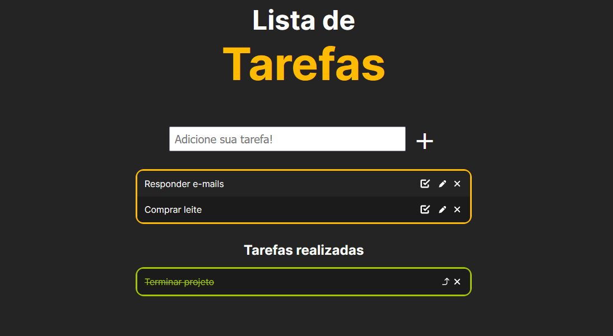

# Sobre

Lista de tarefas simples que desenhei para treinar Javascript.

O projeto me fez compreender melhor as formas de manipular o HTML. Também aprendi a usar o localStorage para armazenar os dados do usuário.

# Screenshots

# Link

[Link para a master no GitHub Pages.](https://g-pg.github.io/to-do-list/)
